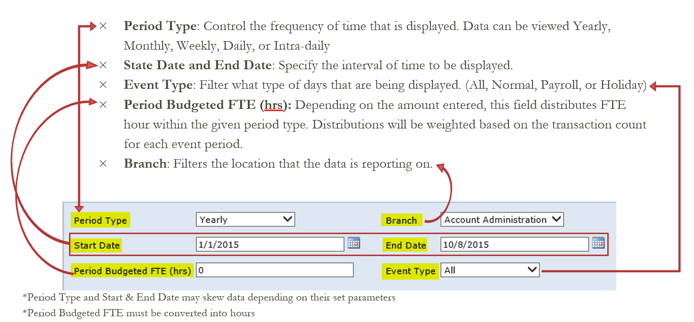
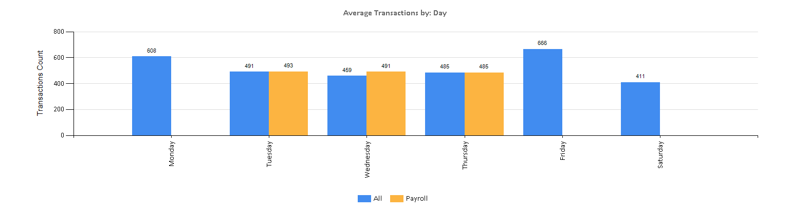
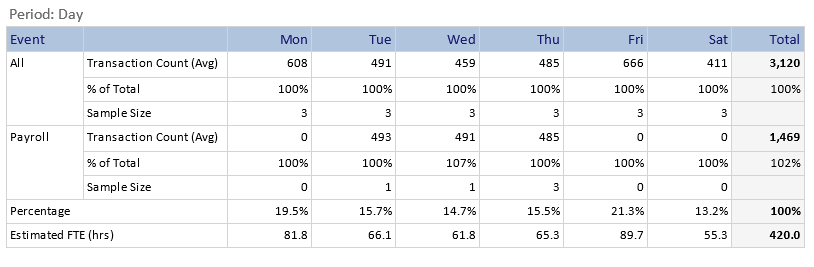

.. BranchVolume documentation UserGuide file, created by
   Justin Hanley on 10/13/2015

User Guide
==========

Features
--------
 The data to construct this dashboard is taken from Symitar and updated daily. The report only counts monetary 
 transactions that are either, done by a team member in the same minute on the same day or by a team member on 
 the same day, under the same sequence number. It then organizes the data by year, month, and date, then separates 
 it by branches and departments. This dash board features parameters that can be customized to retrieve the 
 desired data.

How it Works
------------
 The Dashboard evaluates all of the parameters and displays the average transactions count that occurred in the 
 chosen Period Type.

 Example: This illustrates the average daily transactions for a branch, with a budgeted FTE of 10.5. (420 hours) 

   :

The table splits up the data by event to show their distribution within the chosen time period.

   * Sample size: Counts how many times the event happened within the given start and end times. 
   * Estimated FTE: Allocates the desired hours based on the weight of the transactions per day. 
   * Payroll: Separates the average transactions that occurred on payroll days and compares it with the total average transactions.  
   * Percentage: Divides the Transaction Count (Avg.) of the event by the Total Transaction Count.  

More Samples SubSection
--------------------

More Paragraph Subsubsection
^^^^^^^^^^^^^^^^^^^^^^^^^^^^

Here's a placeholder for some text.
   Some indentation

And a list

   * Item 1
   * Item 2
OR

   #. Item 1
   #. Item 2